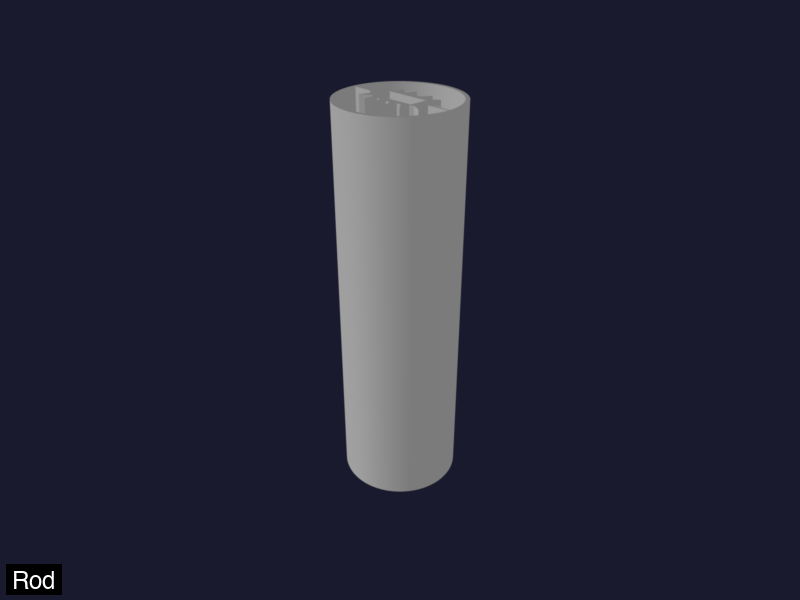

# LED Knots



A Python tool for generating 3D printable mathematical knot models designed to house LED strips. Built using the [CadQuery](https://cadquery.readthedocs.io/) CAD engine.

## Overview

LED Knots creates parametric 3D models of various mathematical knots and paths, each designed with an internal channel to accommodate LED strips. The models can be exported to STL, STEP, or other 3D formats for 3D printing.

### Features

- **Multiple knot types**: From simple rods and rings to complex trefoil and torus knots
- **LED-optimized cross-sections**: Custom cross-section profiles designed for LED strip insertion
- **Auto-diameter calculation**: Automatically calculates optimal tube diameter based on LED count for best light diffusion
- **Diffusion ridges**: Optional triangular ridges on the oval surface for enhanced light diffusion and visual effects
- **Flexible orientation control**: Advanced path curvature analysis and twist optimization
- **Multiple export formats**: STL, STEP, 3MF, GLB/GLTF support
- **Web-based preview**: Optional [cadquery-web-viewer](https://pypi.org/project/cadquery-web-viewer/) integration (embedded Flask thread or HTTP to a long-running server)
- **SLA / resin print optimization**: Detects overhangs, islands, and trapped cavities; auto-rotates parts so the LED-tube radial connectors act as natural support columns. Per-segment rescoring when `max_print_bounds` is enabled. See `print_optimization` in `config.yaml` and the `--optimize` / `--auto-orient` / `--optimize-report-dir` flags.

## Installation

### Using uv (recommended)

```bash
uv pip install -e .
```

### Using pip

```bash
pip install -e .
```

### Dependencies

- Python 3.12 (required by `cadquery-web-viewer`; see `requires-python` in `pyproject.toml`)
- CadQuery 2.6.1+
- NumPy
- pyknotid (for mathematical knot generation)
- cadquery-web-viewer (browser 3D preview; optional at runtime unless you use `--server` / `--viewer`)

## Quick Start

Each knot type can be run as a standalone script. Export to a file, or view in the built-in viewer.

```bash
# Export to STL (or .step, .3mf, .glb, .gltf)
python -m led_knots.knots.trefoil --export trefoil.stl
# or, if installed: led-knots-trefoil --export trefoil.stl

# Build geometry headlessly (no browser unless viewer flags below)
python -m led_knots.knots.trefoil

# Browser preview: default config uses remote — start the viewer server first
#   cadquery-web-viewer --host localhost --port 32323
python -m led_knots.knots.trefoil --server

# In-process embedded viewer (opens a local tab)
python -m led_knots.knots.trefoil --viewer embedded
```

### Available commands

| Command | Description |
|---------|-------------|
| `led-knots-rod` | Straight vertical pipe |
| `led-knots-ring` | Simple circular ring |
| `led-knots-helix` | Helical spiral path |
| `led-knots-sine-wave` | Sine wave oscillation path |
| `led-knots-trefoil` | Mathematical trefoil knot |
| `led-knots-figure-8` | Figure-8 / torus knot |
| `led-knots-jog-bend` | 2D jog bend path |
| `led-knots-jog-bend-3d` | 3D jog bend with orientation control |
| `led-knots-quarter-turn` | 90-degree turn path |
| `led-knots-twisted-rod` | Straight rod with 90-degree twist |

### Command line options

All knot commands accept the same options:

| Option | Description |
|--------|-------------|
| `--export FILEPATH` | Export the model to a file. Supported formats: `.stl`, `.step`, `.stp`, `.3mf`, `.glb`, `.gltf` |
| `--output-mesh FILEPATH` | Export a simulation-focused mesh using trimesh. Currently only `.obj` is supported and is tuned for physics engines like Genesis (meters, watertightness, optional decimation). |
| `--server` | Enable browser preview using `server.viewer` from `config.yaml` (legacy alias; prefer `--viewer`) |
| `--viewer MODE` | `off`, `embedded`, `embedded-block`, or `remote` (overrides `server.viewer.mode` when set) |
| `--optimize` / `--no-optimize` | Run the SLA print-optimization stage; reports overhang clusters, islands, and connector tagging on the built mesh. |
| `--auto-orient` | Apply the top-ranked SLA orientation to the exported geometry (implies `--optimize`). For LED-tube knots, the score is biased toward orientations that stand the radial connector strips vertically so they act as natural support columns. |
| `--optimize-report-dir DIR` | Write annotated PNG diagnostics for the optimizer (top + bottom views, with overhangs in red and connectors in green) to DIR. Implies `--optimize`. |
| `-v`, `--verbose` | Enable debug-level logging |

When you omit `--export` and any viewer flag (`--server` / `--viewer` not enabling preview), the knot still builds geometry headlessly. Use `--server` or `--viewer …` to send the model to **cadquery-web-viewer** (remote server or embedded).

## Configuration

LED Knots uses a centralized configuration system via `config.yaml` in the project root. This file controls:

- **Output bounds**: Dimensions for the generated models (width, length, height)
- **face_type**: Top-level key selecting the cross-section face (e.g. `led_circle`, `square`)
- **Face settings**: Per-face options keyed by face name: `outer_diameter` or `outer_width` (for square), `wall_thickness` (e.g. in led_circle), `rect_inner_x` / `rect_inner_y` (led_circle cavity, with comments referencing original strip values), oval/connector/diffusion options. Use `inherit_from` to inherit from another face and override keys.
- **Path**: `min_90_degree_twist_distance` (mm) for twist rate limits along the path
- **Server**: `server.viewer` (embedded vs remote) and optional styling keys mapped to `CADQUERY_WEB_VIEWER_*` environment variables (`protocol`, `texture`, `color_faces`, `color_edges`, `color_vertices`)
- **Export settings**: Export tolerances for 3D file formats

### Server and browser viewer

The **server** section configures [cadquery-web-viewer](https://github.com/jimcortez/cadquery-web-viewer) behavior:

```yaml
server:
  # Optional styling (applied as CADQUERY_WEB_VIEWER_* before import):
  # protocol: HTTP
  # texture: "data:image/png;base64,..."
  # color_faces: '#ffbf00'
  # color_edges: '#1a1aff'
  # color_vertices: '#1a1a1a'
  viewer:
    mode: remote          # off | embedded | remote
    embedded:
      host: 127.0.0.1
      port: 32323
      open_browser: true
      wait_for_first_client: false
      block_until_disconnect: false
    remote:
      host: localhost
      port: 32323
```

- **viewer.mode `remote`**: Each knot run POSTs the model to `http://<remote.host>:<remote.port>`; run `cadquery-web-viewer` (or `python -m cadquery_web_viewer`) in another terminal first. The CLI exits immediately after upload when there is no `--output-mesh` or `--preview` follow-up (caching is handled by the viewer server).
- **viewer.mode `embedded`**: The viewer starts an in-process Flask server when you call `show()`; use `embedded-block` / `block_until_disconnect: true` for the “wait until you close the tab” workflow.
- **Styling keys** at the `server` level set `CADQUERY_WEB_VIEWER_*` so defaults match your project without exporting shell variables by hand.

### Configuration details

#### Face type and face settings

- **face_type** is a top-level key (e.g. `face_type: led_circle`). It selects which face from `face_settings` is used.
- **face_settings** is keyed by face name (`led_circle`, `led_circle_diffusion_pyramids`, `solid_circle`, `solid_circle_pyramid`, `square`). Each face defines its own dimensions and options:
  - **led_circle**: `outer_diameter`, `wall_thickness`, `rect_inner_x`, `rect_inner_y` (cavity for LED strip; comments in config can reference original strip width/height + tolerances), `oval_wall_thickness`, `connector_width`, `diffusion_ridges`.
  - **solid_circle**: `outer_diameter` only.
  - **solid_circle_pyramid**: `outer_diameter`, `wall_thickness`, `diffusion_ridges`.
  - **square**: `outer_width` (side length in mm).
- **inherit_from**: A face entry can set `inherit_from: <face_name>`. Resolved settings are the inherited face’s settings (recursively), then the current block’s keys overlaid (nested dicts deep-merged). Cycles and missing parents cause an error.

Example:

```yaml
face_type: led_circle

face_settings:
  led_circle:
    outer_diameter: 30
    wall_thickness: 1.0
    rect_inner_x: 4.6   # from strip height 1.8*2 (double-sided) + tolerance 1
    rect_inner_y: 11.0  # from strip width 10 + tolerance 1
    oval_wall_thickness: 0.5
    connector_width: 0.5
    diffusion_ridges: { ridge_height: 2.5, ridge_width: 2.0, ridge_spacing: 1, ridge_depth: 2.5 }
  led_circle_diffusion_pyramids:
    inherit_from: led_circle
    diffusion_ridges: { ridge_height: 3.0, ... }  # override
  solid_circle:
    outer_diameter: 30
  square:
    outer_width: 30
```

#### Path settings

The **path** section provides twist limits along the sweep path:

```yaml
path:
  min_90_degree_twist_distance: 5  # mm minimum distance for 90° twist
```

#### Diffusion Ridges

Optional triangular ridges on the oval cross-section (e.g. for `led_circle` or `led_circle_diffusion_pyramids`) are configured under **face_settings**:

```yaml
face_settings:
  led_circle:
    diffusion_ridges:
      ridge_height: 2.5
      ridge_width: 2.0
      ridge_spacing: 1
      ridge_depth: 2.5
```

Set `diffusion_ridges: false` or omit the key to disable ridges for that face.

#### LED cavity dimensions (led_circle)

Inner rectangle dimensions `rect_inner_x` and `rect_inner_y` in **face_settings.led_circle** define the cavity for the LED strip. Set them to match your strip width/height plus tolerances (e.g. strip width 10 mm + tolerance 1 mm → `rect_inner_y: 11.0`; strip height 1.8 mm, double-sided, + tolerance → `rect_inner_x: 4.6`). The config file comments can reference these original values.

### Customizing Configuration

You can override the default `config.yaml` by creating a `config.local.yaml` file in the project root. This allows you to customize settings without modifying the default configuration.

Example `config.local.yaml`:
```yaml
output_bounds:
  width: 150
  height: 200

face_type: led_circle

face_settings:
  led_circle:
    outer_diameter: 35
    wall_thickness: 1.5
```

All knot modules automatically use these configuration values, making it easy to adjust model dimensions and tube parameters across all knot types.

#### Mesh export settings

The **mesh** section in `config.yaml` controls how simulation-focused meshes (for example, OBJ files for Genesis) are generated:

```yaml
mesh:
  # Optional unit scaling for mesh export. If true, convert dimensions
  # from millimeters (CadQuery default) to meters (Genesis and many
  # physics engines use meters).
  unit_scale_mm_to_m: true

  # Optional maximum triangle count for mesh decimation. If null or
  # omitted, no automatic decimation is applied. When set, trimesh will
  # attempt to simplify the mesh to approximately this many faces.
  target_face_count: null

  # Require watertight (closed) meshes for export. If true and the
  # generated mesh is not watertight, mesh export will fail with a
  # clear error instead of writing a partial mesh.
  watertight_required: true
```

When you supply `--output-mesh path/to/model.obj`, the library will reuse the internal GLB representation whenever possible and convert it to OBJ using trimesh, applying these settings.

## LED Cross-Section Design

The LED cross-section consists of:

1. **Outer ring**: The main structural housing
2. **Center oval**: An elliptical cavity with a rectangular inner cutout for the LED strip
3. **Connecting bars**: Links between the outer ring and center oval
4. **Diffusion ridges** (optional): Triangular ridges on the outside of the oval for enhanced light diffusion

This design allows the LED strip to be inserted into the center channel while the outer ring provides structural support and diffusion. The optional diffusion ridges create additional surface area and light-scattering effects for improved visual appearance.


## License

This project is licensed under the GNU General Public License v3.0 - see the [LICENSE](LICENSE) file for details.

## Contributing

Contributions are welcome! Please feel free to submit issues or pull requests.
