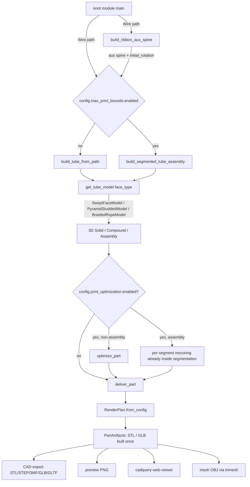

# Architecture

## Overview

`led_knots` turns mathematical knot definitions into 3D-printable LED housings.
Each knot module defines a centerline path as a CadQuery `Wire`; the shared
pipeline samples that path into parallel-transported frames, sweeps a configured
cross-section profile along it to produce a tube `Solid` or `Compound`, and then
fans the result out to whichever outputs the user asked for: a CAD file (STL /
STEP / 3MF / GLB / GLTF), a rendered PNG preview, an interactive web viewer
session, and/or a simulation OBJ mesh.

Optional stages sit between "tube built" and "tube delivered". A
`max_print_bounds`-driven segmentation stage chops the tube into bed-sized
pieces and grafts on lap-joint / pin / dovetail registration features so the
segments physically register and bond. An SLA `print_optimization` stage
tessellates the result, picks the best build orientation via a Tweaker-3 port
(optionally biased by connector-strip verticality), analyses overhangs / islands
/ cavities, and can auto-drill drain holes for trapped resin pockets.

Conceptually the codebase is four layers, all wired together by `config.yaml`:

1. **Knots** (`src/led_knots/knots/`) — one module per knot, each producing a
   centerline `Wire`.
2. **Path utilities** (`src/led_knots/core/path_utils.py`,
   [path_frames.py](../src/led_knots/core/path_frames.py)) — sample the path,
   build parallel-transported frames, and synthesize the auxiliary spine that
   controls ribbon twist.
3. **Tube models** (`src/led_knots/core/tube_models/`) — a `TubeModel` registry
   keyed on `face_type` that turns `(path, aux, config)` into a 3D solid /
   compound.
4. **Render / output** (`src/led_knots/core/render_pipeline.py`,
   [preview.py](../src/led_knots/core/preview.py),
   [print_segmentation.py](../src/led_knots/core/print_segmentation.py),
   [optimize/](../src/led_knots/optimize/)) — segmentation, print optimization,
   STL / GLB tessellation, viewer hand-off, preview PNG.

See also the [code map](code-map.md) for a per-file breakdown and the
[configuration reference](configuration.md) for every config key.

## Data flow

The orchestrating function is
[`draw_part`](../src/led_knots/core/utils.py#L244) in
[src/led_knots/core/utils.py](../src/led_knots/core/utils.py). It is called by
every knot module's `main()`. Here is the path data takes from a knot script to
a file on disk:



Step-by-step:

1. The knot module (e.g. [trefoil.py](../src/led_knots/knots/trefoil.py)) builds
   a CadQuery `Wire` describing the centerline. It calls `get_config(...)` to
   pick up the merged YAML + CLI configuration.
2. Most knots call
   [`build_ribbon_aux_spine`](../src/led_knots/core/path_utils.py#L476) to
   compute an auxiliary spine that constrains ribbon twist using path curvature
   and `path.min_90_degree_twist_distance`. The result is a second `Wire`
   passed to CadQuery's `sweep(..., aux=...)`.
3. The knot calls `draw_part(path, config, aux=aux, **face_kwargs)`.
4. `draw_part` branches on `config.max_print_bounds.enabled`:
   - **Disabled**: calls
     [`build_tube_from_path`](../src/led_knots/core/utils.py#L176), which looks
     up `config.tube_settings.face_type` in the tube-model registry and runs
     `model.build(path=..., aux=..., config=..., face_kwargs=...)`. Returns a
     `Solid` or `Compound`.
   - **Enabled**: calls
     [`build_segmented_tube_assembly`](../src/led_knots/core/print_segmentation.py#L204),
     which samples the path, plans segment cuts that fit the print bed,
     builds each segment's tube via the same `build_tube_from_path` callback,
     applies lap-joint and registration features
     ([print_joint.py](../src/led_knots/core/print_joint.py)), and returns a
     `cq.Assembly`.
5. If `config.print_optimization.enabled`, single-piece results are rotated /
   analysed via [`optimize_part`](../src/led_knots/optimize/__init__.py#L242).
   Assemblies are skipped at this level because per-segment rescoring already
   happened inside `build_segmented_tube_assembly`.
6. The (possibly rotated) part is handed to
   [`deliver_part`](../src/led_knots/core/render_pipeline.py#L720), which:
   - Builds a [`RenderPlan`](../src/led_knots/core/render_pipeline.py#L312) from
     the configured outcomes (preview PNG, CAD export, viewer, mesh OBJ).
   - Lazily builds at most one STL and at most one GLB via
     [`PartArtifacts`](../src/led_knots/core/render_pipeline.py#L379), reusing
     bytes across outcomes.
   - Emits each requested outcome: writes the CAD export file, renders the PNG
     via [preview.py](../src/led_knots/core/preview.py), posts geometry to
     `cadquery-web-viewer`, and/or writes an OBJ via `trimesh`.

## Module layout

```
src/led_knots/
├── __init__.py
├── core/                       # Pipeline, config, framing, rendering, segmentation
│   ├── __init__.py
│   ├── cache_utils.py          # STL preview cache keyed on path + tube settings
│   ├── color_palette.py        # Per-part colour assignment for viewer / GLB
│   ├── config.py               # YAML + CLI merging; get_config(); Config object
│   ├── led_circle.py           # LED-circle face profile (channel + walls + cavity)
│   ├── path_frames.py          # Parallel-transported PathFrame sampling
│   ├── path_utils.py           # spline()/Wire helpers + build_ribbon_aux_spine
│   ├── preview.py              # GLB / STL -> PNG via trimesh + pyrender
│   ├── print_joint.py          # Lap rabbets, twin pins, dovetail features
│   ├── print_segmentation.py   # build_segmented_tube_assembly + plan_segments
│   ├── pyknot_utils.py         # pyknotid helpers (parametrisation, classification)
│   ├── render_pipeline.py      # RenderPlan, PartArtifacts, deliver_part
│   ├── utils.py                # parse_args, draw_part, build_tube_from_path
│   └── tube_models/            # TubeModel implementations + registry
│       ├── __init__.py         # _REGISTRY, get_tube_model, register_tube_model
│       ├── _base.py            # TubeModel protocol
│       ├── swept_face.py       # led_circle / led_circle_tube / solid_circle / square
│       ├── pyramid_studded.py  # Pyramid-studded tube (compound)
│       └── braided_rope.py     # Core + N braided strands (compound)
├── knots/                      # One module per knot, each with a main()
│   ├── __init__.py
│   ├── figure_8.py, helix.py, jog_bend.py, jog_bend_3d.py,
│   ├── k4_1.py, k8_21.py, quarter_turn.py, ring.py, rod.py,
│   ├── sine_wave.py, stevedore.py, trefoil.py, twisted_rod.py
├── optimize/                   # SLA / resin print optimisation stage
│   ├── __init__.py             # optimize_part entry point
│   ├── _tweaker.py             # Vendored Tweaker-3 orientation search
│   ├── analysis.py             # detect_overhangs, detect_islands, detect_trapped_cavities
│   ├── drain_holes.py          # drill_drain_holes (manifold3d boolean)
│   ├── face_tagging.py         # tag_connector_faces for connector-aware bonus
│   ├── orient.py               # rotation scoring + candidate rescoring
│   ├── report.py               # OptimizationReport, OrientationCandidate, format_console
│   └── settings.py             # PrintOptimizationSettings dataclasses
└── parts/                      # Reusable mechanical sub-parts for assemblies
    ├── __init__.py
    ├── hang_clamp.py           # Hang-clamp halves bolted around a tube
    └── planet_spacer.py        # Planet-style spacer ring
```

For finer-grained, function-level descriptions of each file, see the
[code map](code-map.md).

## Key abstractions

### Path

A knot's path is a CadQuery `Wire` (occasionally an `Edge`) produced by a
function inside a knot module. Paths are typically built from parametric splines
via the `spline(points)` helper in
[path_utils.py](../src/led_knots/core/path_utils.py), then sampled into
`PathFrame` objects by
[`path_frames.py`](../src/led_knots/core/path_frames.py#L25). A `PathFrame`
carries the arc-length position `t`, the world-space `point`, the unit
`tangent`, and an in-cross-section `(x_dir, y_dir)` basis that is
parallel-transported from the start of the path so the cross-section does not
flip on curves. All tube models consume the same frames, which is what keeps
non-trivial faces (like the LED channel) coherently oriented even on highly
curved knots. Most paths additionally come with an auxiliary spine from
[`build_ribbon_aux_spine`](../src/led_knots/core/path_utils.py#L476); it is fed
to CadQuery's `sweep(..., aux=...)` to lock down ribbon twist while respecting
`path.min_90_degree_twist_distance`. See the [paths cookbook](paths.md) for how
to add a new knot.

### TubeModel protocol and the face_type registry

A `TubeModel` is the abstraction that turns a centerline into 3D geometry. The
protocol lives in
[tube_models/_base.py](../src/led_knots/core/tube_models/_base.py#L11):

```python
class TubeModel(Protocol):
    def build(
        self,
        *,
        path,
        aux,
        config: Any,
        face_kwargs: Optional[Dict[str, Any]] = None,
    ) -> Union[cq.Solid, cq.Compound]: ...
```

Implementations are registered in `_REGISTRY` inside
[tube_models/\_\_init\_\_.py](../src/led_knots/core/tube_models/__init__.py#L17).
The current keys are:

| `face_type`          | Class                | Notes                                                   |
| -------------------- | -------------------- | ------------------------------------------------------- |
| `led_circle`         | `SweptFaceModel`     | LED channel + outer wall + oval cavity (default)        |
| `led_circle_tube`    | `SweptFaceModel`     | Same plus an inner tube cavity                          |
| `solid_circle`       | `SweptFaceModel`     | Plain filled circle                                     |
| `square`             | `SweptFaceModel`     | Plain filled square                                     |
| `pyramid_studded`    | `PyramidStuddedModel`| Swept core with periodic pyramid studs (a `Compound`)   |
| `braided_rope`       | `BraidedRopeModel`   | Core plus N helical strands (a `Compound`)              |

`build_tube_from_path` resolves the active model with `get_tube_model(...)` and
delegates. Higher-level models register themselves after `_REGISTRY` exists so
they can themselves call `get_tube_model("solid_circle")` for their underlying
tube. Third-party / experimental models can call
[`register_tube_model(face_type, model)`](../src/led_knots/core/tube_models/__init__.py#L35)
before `draw_part` runs. See the [tube models cookbook](tube-models.md) for the
extension recipe.

### Config

Configuration is a layered YAML + CLI structure exposed through
[`get_config(...)`](../src/led_knots/core/config.py#L643). On first call it:

1. Loads `config.yaml` from the repo root.
2. Deep-merges `config.local.yaml` on top, if present.
3. Resolves the active `face_type` and its `face_settings.<face_type>` block via
   [`resolve_face_settings`](../src/led_knots/core/config.py#L46), which walks
   the optional `inherit_from` chain and deep-merges parent keys with child
   keys — so a `face_settings.led_circle_v2` block can `inherit_from:
   led_circle` and only override the deltas. Cycles and missing parents are
   detected and raised.
4. Builds a `TubeSettings(face_type, resolved_face_data)` convenience object
   that knot modules use as `config.tube_settings.<key>` without having to know
   which face type they were called with.
5. Parses `argparse` flags via
   [`parse_args`](../src/led_knots/core/utils.py#L32) and lets CLI options
   override matching config keys (e.g. `--export`, `--preview`, `--viewer`,
   `--optimize / --no-optimize`, `--auto-orient`,
   `--optimize-report-dir`, `--export-parts`).

The returned `Config` exposes substructures used throughout the pipeline:
`output_bounds`, `tube_settings`, `path_settings`, `max_print_bounds`,
`tube_gap`, `clamp`, `print_optimization`, `server_settings`, `export`, `mesh`,
`preview_settings`, plus CLI-derived attributes like `viewer_enabled`,
`viewer_server_type`, `preview_filepath`, `export_parts`. Every documented key
is enumerated in the [configuration reference](configuration.md).

## Extension surfaces

The shortest path to adding new functionality:

- **New knot** — add a module under
  [src/led_knots/knots/](../src/led_knots/knots/) that builds a `Wire`, calls
  `build_ribbon_aux_spine` and `draw_part`, and (optionally) exposes a `main()`
  registered in `pyproject.toml` `[project.scripts]`. Recipe and worked example
  in the [paths cookbook](paths.md).
- **New tube cross-section / geometry style** — implement the `TubeModel`
  protocol from [\_base.py](../src/led_knots/core/tube_models/_base.py), call
  `register_tube_model("my_face_type", MyModel())`, and add a matching
  `face_settings.my_face_type` block in `config.yaml`. Recipe in the
  [tube models cookbook](tube-models.md).
- **New face profile for `SweptFaceModel`** — extend
  [led_circle.py](../src/led_knots/core/led_circle.py) (or add a sibling face
  generator) and wire it into `SweptFaceModel`'s face-type switch. Also covered
  in the [tube models cookbook](tube-models.md).
- **New optimisation analyser** — add a `detect_*` function in
  [optimize/analysis.py](../src/led_knots/optimize/analysis.py) and surface it
  on `OptimizationReport` (see
  [print optimization](print-optimization.md)).
- **New joint type** — extend
  [print_joint.py](../src/led_knots/core/print_joint.py) and add the type to
  the joint-selection logic in
  [print_segmentation.py](../src/led_knots/core/print_segmentation.py) (see
  [print segmentation](print-segmentation.md)).
- **New reusable mechanical sub-part** — add a module under
  [src/led_knots/parts/](../src/led_knots/parts/) following the
  [hang_clamp.py](../src/led_knots/parts/hang_clamp.py) pattern.

## Optional stages

Each of these is opt-in via `config.yaml` and/or CLI flags. They are wired into
the same `draw_part` -> `deliver_part` pipeline; they do not require a separate
script.

- **Preview PNG** — set `--preview <file.png>` (or `config.preview_filepath`).
  Renders the active part via trimesh + pyrender at the camera angles defined
  in `preview.*`. See the [preview / images doc](rendering-and-preview.md).
- **Web viewer** — `--viewer embedded | embedded-block | remote` (or
  `--server`). Tessellates to GLB and either runs an in-process
  `cadquery-web-viewer` server or POSTs to a running remote one. Per-part
  colouring is applied for assemblies via
  [color_palette.py](../src/led_knots/core/color_palette.py). See the
  [viewer doc](rendering-and-preview.md).
- **Simulation mesh export** — `--output-mesh out.obj` (or `config.mesh.*`).
  Goes through GLB so it reuses any already-built tessellation, then writes a
  cleaned `.obj` via `trimesh`. Optional watertight check and quadratic
  decimation. See the [mesh export doc](mesh-export.md).
- **Print segmentation** — `config.max_print_bounds.enabled = true`. Chops the
  knot into bed-fitting segments and applies lap rabbets, twin pins, or
  dovetail registration features between them. The output is a `cq.Assembly`
  instead of a single solid. See [print segmentation](print-segmentation.md).
- **SLA print optimisation** — `--optimize` (analysis-only) or `--auto-orient`
  (analysis + apply best rotation). Vendored Tweaker-3 orientation search,
  optional connector-strip verticality bonus, overhang / island / cavity
  analysis, bed-fit gate, optional drain-hole drilling via `manifold3d`, and
  annotated PNG diagnostics via `--optimize-report-dir`. See
  [print optimization](print-optimization.md).

## Dependencies

The pipeline leans on a small set of external libraries; knowing which one does
what makes stack traces much easier to read.

- **[CadQuery](https://github.com/CadQuery/cadquery)** (`cadquery>=2.6.1`) —
  the core CAD kernel. All path `Wire`s, swept solids, assemblies, and CAD
  exports (STL, STEP, 3MF, GLB) go through `cq` and its underlying OCP
  (OpenCascade Python) bindings. `path_frames.py` reaches into `OCP.BRepAdaptor`
  and `OCP.GCPnts` directly for uniform arc-length sampling.
- **[pyknotid](https://github.com/sashakolpakov/pyknotid)** — knot-theoretic
  analysis (parametrisation, classification) used by
  [pyknot_utils.py](../src/led_knots/core/pyknot_utils.py) for the higher-order
  knot modules.
- **[trimesh](https://github.com/mikedh/trimesh)** (`trimesh>=4.0.0`) — mesh
  munging for everything downstream of CadQuery's tessellator: STL loading, GLB
  conversion, OBJ export, quadratic decimation, watertight checks, and feeding
  the SLA optimiser.
- **[pyrender](https://github.com/mmatl/pyrender)** (`pyrender>=0.1.45`) and
  **Pillow** — used by [preview.py](../src/led_knots/core/preview.py) to render
  PNG previews from STL / GLB meshes.
- **[manifold3d](https://github.com/elalish/manifold)** (`manifold3d>=3.5.1`) —
  robust mesh boolean engine. The SLA optimiser uses it in
  [drain_holes.py](../src/led_knots/optimize/drain_holes.py) to drill drain
  holes through trapped resin cavities.
- **[cadquery-web-viewer](https://github.com/CadQuery/cadquery-web-viewer)**
  (`cadquery-web-viewer>=2.0.0`) — the interactive browser viewer. The
  `--viewer` modes drive its `show` / `render` APIs from
  [render_pipeline.py](../src/led_knots/core/render_pipeline.py).
- **numpy / numba / matplotlib / rtree** — numerical helpers used in twist
  optimisation ([path_utils.py](../src/led_knots/core/path_utils.py)),
  optimiser scoring ([optimize/orient.py](../src/led_knots/optimize/orient.py)),
  and spatial queries.
- **PyYAML** — loads `config.yaml` and `config.local.yaml`.
- **py-lib3mf** — optional 3MF export support via CadQuery.
