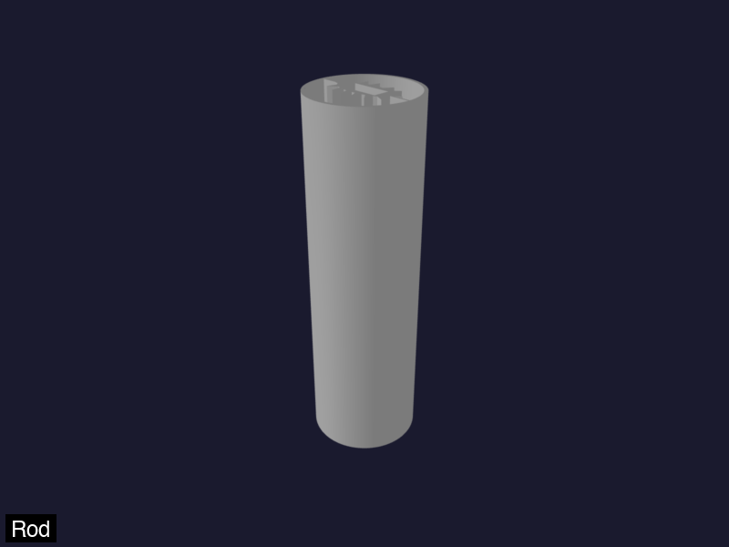
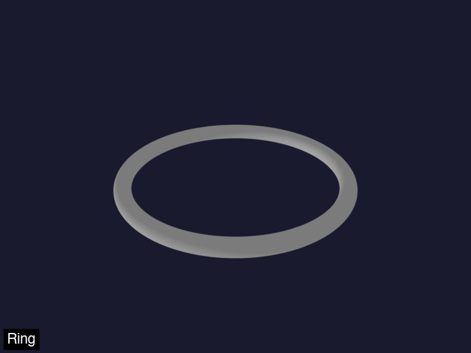
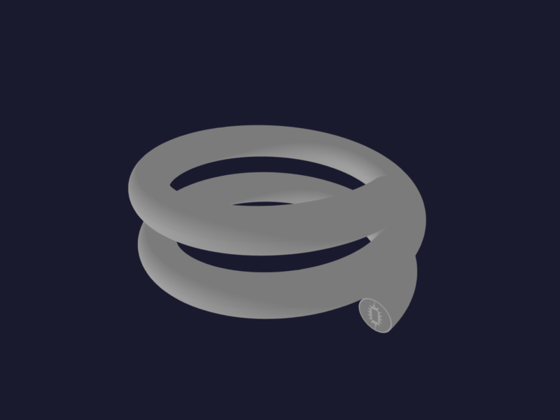
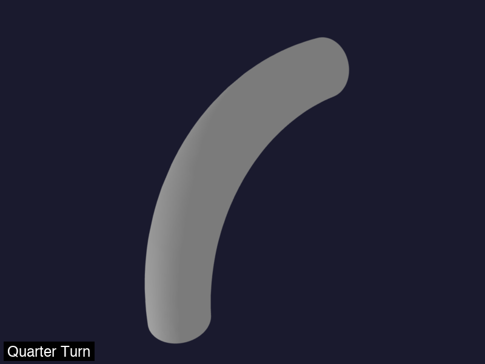
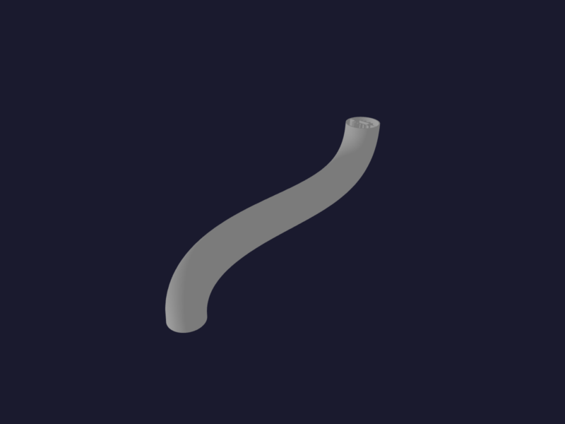
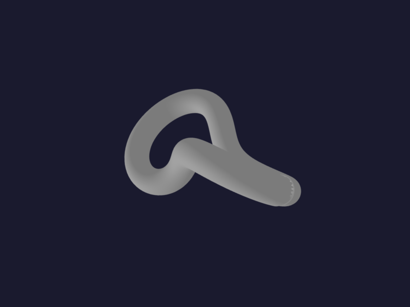

# Screenshots

Preview images for each knot type. Generate any preview with:

```bash
python -m led_knots.knots.<name> --preview assets/<name>.png
```

Or regenerate all previews (and the combined GIF) with:

```bash
uv run python scripts/generate_previews.py
```

## Table of contents

- [Rod](#rod)
- [Ring](#ring)
- [Helix](#helix)
- [Quarter turn](#quarter-turn)
- [Jog bend](#jog-bend)
- [Figure 8](#figure-8)

---

## Rod

Straight vertical pipe.



```bash
python -m led_knots.knots.rod --preview assets/rod.png
# Export to STL:
python -m led_knots.knots.rod --export rod.stl
```

---

## Ring

Simple circular ring.



```bash
python -m led_knots.knots.ring --preview assets/ring.png
# Export to STL:
python -m led_knots.knots.ring --export ring.stl
```

---

## Helix

Helical spiral path.



```bash
python -m led_knots.knots.helix --preview assets/helix.png
# Export to STL:
python -m led_knots.knots.helix --export helix.stl
```

---

## Quarter turn

90-degree turn path.



```bash
python -m led_knots.knots.quarter_turn --preview assets/quarter_turn.png
# Export to STL:
python -m led_knots.knots.quarter_turn --export quarter_turn.stl
```

---

## Jog bend

2D jog bend path.



```bash
python -m led_knots.knots.jog_bend --preview assets/jog_bend.png
# Export to STL:
python -m led_knots.knots.jog_bend --export jog_bend.stl
```

---

## Figure 8

Figure-8 / torus knot.



```bash
python -m led_knots.knots.figure_8 --preview assets/figure_8.png
# Export to STL:
python -m led_knots.knots.figure_8 --export figure_8.stl
```
